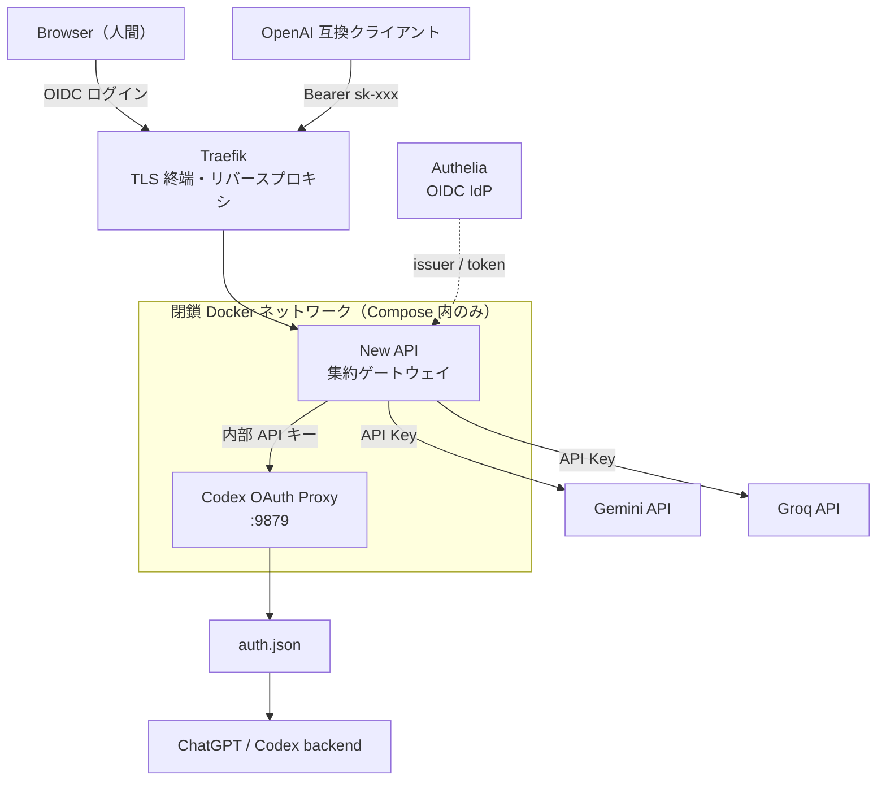

# New API + Codex OAuth Proxy セットアップガイド

ChatGPT (Plus / Pro) の Codex を OpenAI 互換 API として扱い、各 AI プロバイダ (Gemini / Groq / OpenAI など) を 1 つのエンドポイントに集約するための構築手順です。

- 集約ゲートウェイ: [New API](https://github.com/QuantumNous/new-api)
- Codex 上流: [Codex OAuth Proxy](https://github.com/dvcrn/codex-oauth-proxy)
- リバースプロキシ / TLS: Traefik
- 認証基盤（Web UI の人間ログイン）: Authelia (OIDC)

---

## 0. 前提条件

本手順は、以下を**すでに満たしている**ことを前提とします。

| # | 前提 | 内容 |
|---|---|---|
| 1 | ホスト | Linux ホスト（ARM64 / x86_64 どちらでも可） |
| 2 | コンテナ | Docker / Docker Compose (v2) |
| 3 | Traefik | 独立した Traefik が動作しており、Docker provider で `traefik.enable=true` のコンテナを自動取得している |
| 4 | 証明書 | Traefik 側に `*.example.com` などのワイルドカード証明書が発行済み |
| 5 | Authelia | 独立した Authelia が動作しており、OIDC Provider として利用できる |
| 6 | DNS | `new-api.example.com` / `auth.example.com` が上記ホストへ解決される |
| 7 | 外部到達 | `https://new-api.example.com` にブラウザと API クライアントから到達できる |

> [!NOTE]
> Traefik と Authelia は本手順の Compose とは**完全に独立した**別コンテナ・別プロジェクトです。
> 本手順では Authelia を OIDC IdP としてのみ使用します。

### 認証方式の設計思想

4 つの認証を混ぜずに分離することが本構成の要点です。

| 区間 | 認証方式 |
|---|---|
| Browser → New API Web UI | Authelia OIDC（人がログイン） |
| Client → New API `/v1/*` | New API が発行する API トークン |
| New API → Codex OAuth Proxy | 内部 API キー（閉鎖 Docker ネットワーク内） |
| Codex OAuth Proxy → ChatGPT | `auth.json`（OAuth credential） |



---

## 1. ディレクトリ構成

以下のように配置します。

```text
ai-gateway/
├── compose.yml
├── codex-proxy.Dockerfile
├── .env
├── .gitignore
├── data/  # New API のデータ（SQLite DB / ログ）
└── codex-proxy/auth.json  # 手順 3 で生成する（Git 追跡しない）
```

作業ディレクトリへ移動し、権限を整えます。

```sh
cd new-api
mkdir -p data codex-proxy
chown -R 1000:1000 data codex-proxy
```

> [!IMPORTANT]
> コンテナは UID/GID `1000` で動作します（root 実行を避けるため）。
> `data/` と `codex-proxy/auth.json` の所有者を `1000:1000` に一致させてください。

---

## 2. 設定ファイル

### `.env`

```dotenv
# New API のセッション署名。openssl rand -hex 32 で生成
SESSION_SECRET=<openssl rand -hex 32 の出力>

# ベースドメイン。Traefik の Host ルール生成に使う
DOMAIN=example.com

# タイムゾーン
TZ=Asia/Tokyo

# コンテナ実行ユーザー（任意）
UID=1000
GID=1000
```

> [!NOTE]
> New API → Codex OAuth Proxy 間の内部認証キー `ADMIN_API_KEY` は `.env` に用意しません。
> Compose 内で固定値 `internal-only` を直接書いています（§2 `compose.yml` 参照）。
> Codex Proxy は `ports:` で公開されず、`compose.yml` で定義した閉鎖ネットワークに
> 接続したコンテナからのみ到達できるため、値はランダムである必要はありません。

---

## 3. Codex OAuth credential を作成する

Codex OAuth Proxy は ChatGPT Plus / Pro の Codex OAuth credential を `auth.json` から読み込みます。
`auth.json` が無いと起動に失敗します。

> [!IMPORTANT]
> **Codex CLI はホストへインストールしません。**
> 一時的な Node コンテナ内で公式 `@openai/codex` を実行し、`auth.json` だけを生成します。

### 3.1 device auth（推奨・headless 環境に最適）

Raspberry Pi のようなヘッドレス環境でも、ブラウザからURLを開くだけで device code による認証ができます。

以下は一時コンテナ内で Codex CLI を実行する例です。

```sh
docker run --rm -it \
  --user 1000:1000 \
  -e HOME=/tmp \
  -e CODEX_HOME=/codex \
  -e npm_config_cache=/tmp/.npm \
  -v "$PWD/codex-proxy:/codex" \
  node:slim \
  sh -lc '
    apt-get update >/dev/null &&
    apt-get install -y --no-install-recommends ca-certificates >/dev/null &&
    update-ca-certificates >/dev/null &&
    exec npx -y @openai/codex login --device-auth
  '
```

画面に表示された URL と device code を使い、ブラウザで ChatGPT Plus / Pro のアカウントへログインして認証します。

生成されたことを確認します。

```sh
test -s ./codex-proxy/auth.json && echo "auth.json: OK"
```

権限を絞ります。

```sh
chmod 600 ./codex-proxy/auth.json
chown 1000:1000 ./codex-proxy/auth.json
```

> [!NOTE]
> 企業・Workspace アカウントでは `--device-auth` が許可されていない場合があります。
> その場合は §3.2 のブラウザ callback 方式を使います。
> 個人の Plus / Pro であれば device auth が最も簡単です。

### 3.2 ブラウザ callback を使う場合

TCP 1455 へブラウザから到達できる環境なら、callback ポートを公開して通常ログインもできます。

```sh
docker run --rm -it \
  --user 1000:1000 \
  -e HOME=/tmp \
  -e CODEX_HOME=/codex \
  -e npm_config_cache=/tmp/.npm \
  -p 1455:1455 \
  -v "$PWD/codex-proxy:/codex" \
  node:slim \
  sh -lc '
    apt-get update >/dev/null &&
    apt-get install -y --no-install-recommends ca-certificates >/dev/null &&
    update-ca-certificates >/dev/null &&
    exec npx -y @openai/codex login
  '
```

リモートサーバーの場合は device auth の方が簡単です。

---

## 4. ビルドと起動

```sh
docker compose build --pull
docker compose up -d
docker compose ps
```

期待される状態:

```text
new-api       ...   healthy
codex-proxy   ...   healthy
```

内部ネットワークからの疎通確認:

```sh
docker compose exec new-api wget -q -O - http://codex-proxy:9879/health
```

ログ確認:

```sh
docker compose logs --tail=100 codex-proxy
```

> [!IMPORTANT]
> Codex Proxy の `9879` は `ports:` で公開しません（`expose:` のみ）。
> これにより Docker 内部ネットワーク経由でのみ到達可能になります。

---

## 5. Codex OAuth Proxy の認証

Codex OAuth Proxy には 2 種類の認証があります。

### 5.1 `auth.json` — 上流 ChatGPT への認証

- ChatGPT / Codex backend へ接続するための OAuth credential
- token refresh 後に**書き換えられる**ため `read-only` mount にしない
- ファイル単位の bind mount にして、コンテナ再生成で消失しないようにする
- 秘密情報として扱い、`chmod 600` + Git 管理外

### 5.2 `ADMIN_API_KEY` — New API → Proxy 間の認証

- `compose.yml` の `codex-proxy.environment` に直接書く（`.env` は使わない）
- 値は `internal-only`。Compose で定義した閉鎖ネットワーク内でのみ使い、 `ports:` で公開しないため外部から到達できません
- Channel 登録時に、同じ値 `internal-only` を API Key として指定する
- 公開リポジトリへ載せる前提ではない — 閉鎖ネットワーク内の識別子にすぎません

---

## 6. New API 初期セットアップ

ブラウザでアクセスします。

```text
https://new-api.example.com
```

まだ reverse proxy / TLS が動作していない初期確認時のみ:

```text
http://<host-ip>:3000
```

初回セットアップ画面で root / 管理者アカウントを作成します。

> [!IMPORTANT]
> このローカル管理者アカウントは **OIDC の正常動作を確認するまで削除しないでください。**
> OIDC 障害・DNS 障害・証明書更新失敗の際、唯一の復旧手段になります。

---

## 7. Codex OAuth Proxy を Channel として登録する

New API の管理画面から OpenAI Compatible 形式の Channel を追加します。

| 項目 | 値 |
|---|---|
| Name | `Codex OAuth`（任意） |
| Type | OpenAI / OpenAI Compatible |
| Base URL | `http://codex-proxy:9879`（UI が `/v1` を要求する場合は `http://codex-proxy:9879/v1`） |
| API Key | `internal-only`（`compose.yml` の `ADMIN_API_KEY` と同じ値） |
| Models | `/v1/models` の出力から取得 |

モデル ID を推測せず、必ず `/v1/models` の結果を使います。

```sh
docker compose exec new-api wget -q -O - --header="Authorization: Bearer internal-only" http://codex-proxy:9879/v1/models
```

> [!NOTE]
> 上流の仕様変更により `/v1` 付きが要求されるバージョンもあります。
> 404 になる場合は、Base URL の `/v1` 有無を入れ替えて試してください。

同じ Channel 画面から Gemini / Groq など他プロバイダも同様に追加できます。
New API はチャネルごとに API キーとモデルを切り替え、上流の障害を自動フォールバックさせます。

### Codex OAuth Proxy が提供するエンドポイント

```text
POST /v1/chat/completions
POST /v1/responses
GET  /v1/models
GET  /health
```

---

## 8. API 動作を確認する

New API 側で API トークンを発行します（例: `sk-xxxxxxxx`）。

モデル一覧:

```sh
curl https://new-api.example.com/v1/models -H 'Authorization: Bearer sk-xxxxxxxx'
```

Chat Completions:

```sh
curl https://new-api.example.com/v1/chat/completions \
  -H 'Authorization: Bearer sk-xxxxxxxx' \
  -H 'Content-Type: application/json' \
  -d '{
    "model": "YOUR_CODEX_MODEL",
    "messages": [
      { "role": "user", "content": "Hello from New API" }
    ],
    "stream": false
  }'
```

Responses API:

```sh
curl https://new-api.example.com/v1/responses \
  -H 'Authorization: Bearer sk-xxxxxxxx' \
  -H 'Content-Type: application/json' \
  -d '{
    "model": "YOUR_CODEX_MODEL",
    "input": "Hello from New API"
  }'
```

---

# Authelia OIDC 連携

## 9. OIDC Client Secret を生成する

平文 client secret と Authelia 用の digest を作成します。

既存 Authelia コンテナで実行する例:

```sh
docker exec -it authelia authelia crypto hash generate pbkdf2 --variant sha512 --random --random.length 64
```

出力例:

```text
Random Password: <PLAIN_CLIENT_SECRET>
Digest: $pbkdf2-sha512$...
```

使い分け:

| 出力 | 使う場所 |
|---|---|
| `Random Password` | New API (Client Secret) |
| `Digest` | Authelia (`client_secret`) |

平文 secret はパスワードと同様に扱い、Git・チャット・ログへ残さないでください。

---

## 10. Authelia に New API client を登録する

### 10.1 Redirect URL を確定する

**先に** New API の UI で、OIDC 設定に表示される Redirect URL を確認します。

```text
New API 管理画面
  → 設定
  → 登録 / ログイン
  → OAuth / OIDC
```

表示された URL を**そのまま控えます**（バージョン・設定により変わります）。

### 10.2 `configuration.yml` に追加する

Authelia の `identity_providers.oidc.clients` 配下へ追加します。

```yaml
identity_providers:
  oidc:
    clients:
      - client_id: new-api
        client_name: New API
        client_secret: '$pbkdf2-sha512$...'   # ← Digest を設定
        redirect_uris:
          - https://new-api.example.com/oauth/oidc   # ← §10.1 で控えた URL をそのまま
        scopes:
          - openid
          - profile
          - email
        response_types:
          - code
        grant_types:
          - authorization_code
        token_endpoint_auth_method: client_secret_post
```

設定後、Authelia の設定を検証して再起動します。

```sh
docker exec -it authelia authelia validate --config /opt/configs/
docker compose restart authelia   # Authelia の compose ディレクトリで実行
```

Discovery endpoint の確認:

```sh
curl https://auth.example.com/.well-known/openid-configuration
```

---

## 11. New API 側で OIDC を有効化する

| 項目 | 値 |
|---|---|
| Enable OIDC | ON |
| Display Name | `Authelia` |
| Client ID | `new-api` |
| Client Secret | §9 の **Random Password**（平文） |
| Discovery URL / Issuer | `https://auth.example.com/.well-known/openid-configuration`（または UI が要求する issuer） |
| Scope | `openid profile email` |

保存後、シークレットウィンドウなどで:

```text
https://new-api.example.com
```

を開き、`Authelia` ログインボタンから認証できることを確認します。

> [!IMPORTANT]
> **確認が終わるまで、ローカル root アカウントは残してください。**

---

# 運用

## 12. 日常の操作

```sh
docker compose up -d        # 起動
docker compose down         # 停止
docker compose ps           # 状態
docker compose logs -f      # 全ログ
docker compose logs -f codex-proxy
docker compose logs -f new-api
docker compose restart codex-proxy
```

## 13. 更新

```sh
docker compose build --pull && docker compose up -d
```

`codex-proxy.Dockerfile` の `CODEX_PROXY_REF` を新しいタグ／コミットへ変更してから再ビルドします。

# トラブルシューティング

## `codex-proxy` が unhealthy

```sh
docker compose logs --tail=200 codex-proxy
docker compose exec new-api wget -q -O - http://codex-proxy:9879/health
docker compose exec new-api getent hosts codex-proxy
```

DNS 解決できない場合は、両サービスが同じ **名前付き Docker ネットワーク** に参加しているかどうかを確認してください（上記 `compose.yml` の `networks.new-api`）。

## `auth.json` を読めない

ホスト側:

```sh
ls -ln codex-proxy/auth.json  # UID=1000 GID=1000 であることを確認
chown 1000:1000 codex-proxy/auth.json
chmod 600 codex-proxy/auth.json
```

コンテナ側:

```sh
docker compose exec codex-proxy id  # uid=1000
```

## ChatGPT OAuth が失敗する

`docker compose logs codex-proxy` の 401 / token 関連の出力を確認し、§3.1 の device login を再実行してください。
Workspace で device auth が禁止されている場合はこの方式ではログインできません（§3.2 を使用）。

## Authelia から New API に戻れない（callback エラー）

優先度順に確認します。

1. New API UI に表示された Redirect URL と Authelia の `redirect_uris` が**完全一致**しているか
2. `https://` / `http://` が一致しているか
3. hostname が一致しているか（`www` 有無、`-` と `_` の取り違えに注意）
4. callback path が一致しているか
5. Client ID が `new-api` で一致しているか
6. New API には**平文 secret**、Authelia には**hash digest** を設定しているか
7. New API コンテナから Authelia の discovery endpoint へ到達できるか

```sh
docker compose exec new-api wget -q -O - https://auth.example.com/.well-known/openid-configuration
docker exec -it authelia authelia validate --config /opt/configs/
```

---

# 参考

- Codex OAuth Proxy: <https://github.com/dvcrn/codex-oauth-proxy>
- OpenAI Codex: <https://github.com/openai/codex>
- OpenAI Codex releases: <https://github.com/openai/codex/releases>
- New API: <https://github.com/QuantumNous/new-api>
- Authelia OIDC clients: <https://www.authelia.com/configuration/identity-providers/openid-connect/clients/>
- Traefik Docker provider: <https://doc.traefik.io/traefik/providers/docker/>

> `CODEX_PROXY_REF` は再現可能なビルドのため固定値（タグ／コミット）のままにしてください。
> 一方、Codex CLI は `npx -y @openai/codex` で常に最新版を取得するため、バージョン指定は不要です。
